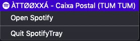

# Spotify Tray Info

Get Spotify current music infos.

`Only tested on MacOs Mojave (Working with dark mode)`

## Desired features

- [ ] Add support to Linux
- [ ] Add support to Windows
- [ ] Create visualization of music cover and play/pause/skip action

## How it works

### With music running

<p align="center">
  
</p>

### With empty music queue

<p align="center">
  
</p>

### With Spotify closed

<p align="center">
  
</p>

## Contribuiting

Fell free to contribute if you get interested in this project

```sh
$ git clone https://github.com/matalmeida/spotify-tray
$ cd spotify-tray
$ npm i
$ npm start
```

## License

[MIT](LICENSE)
